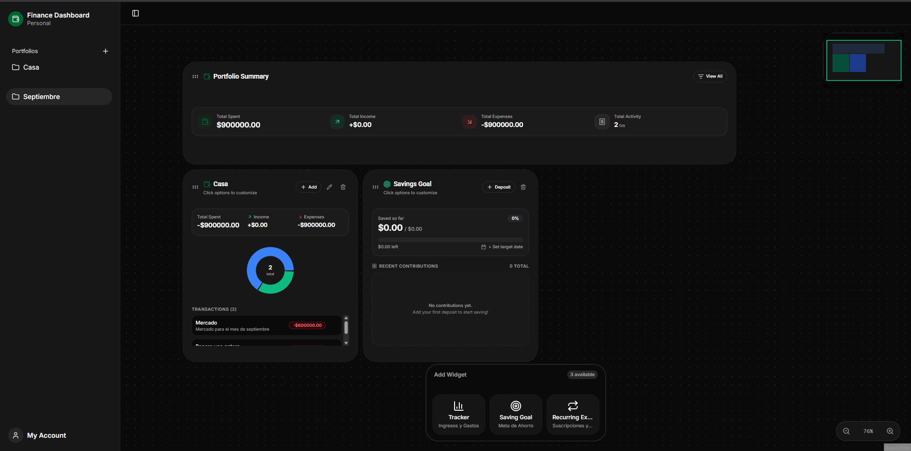
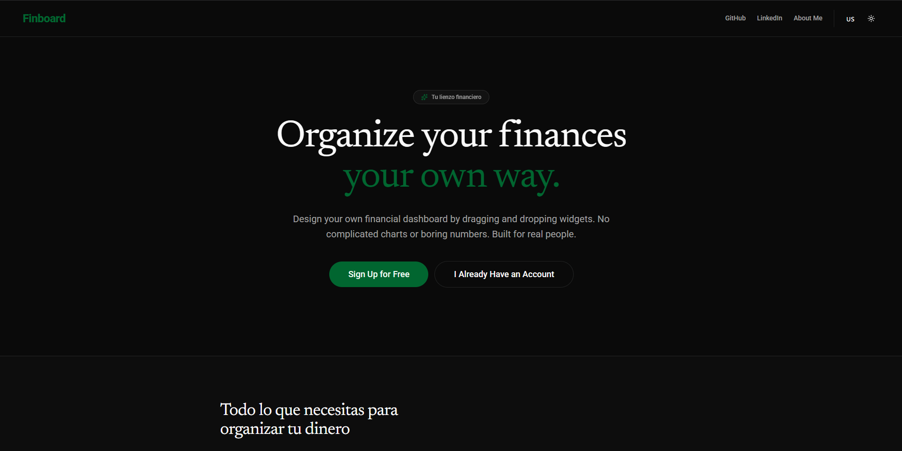
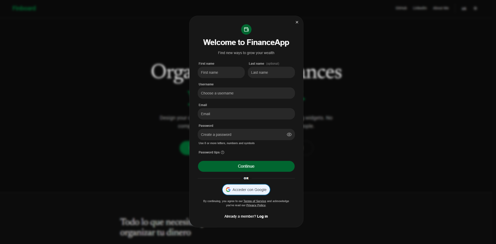
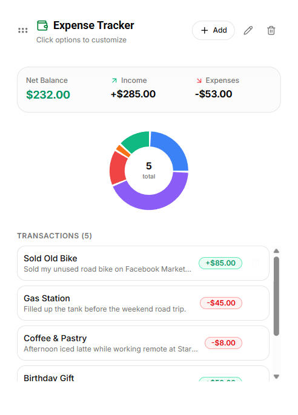
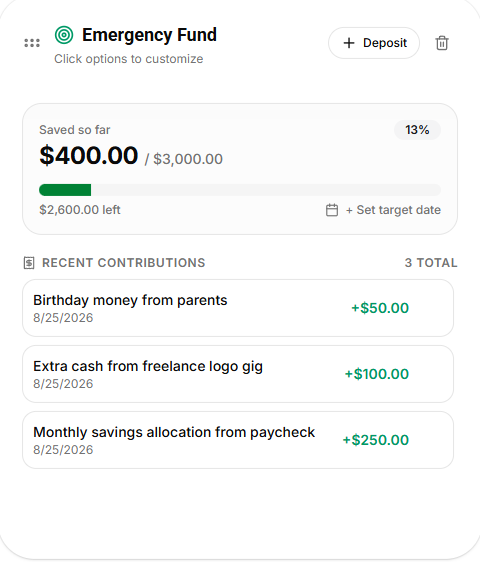
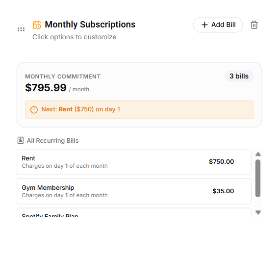

<div align="center">


# 💰 Finance Dashboard

**Dashboard financiero personal con arquitectura de widgets, construido con React + .NET**

[](https://react.dev/)
[](https://www.typescriptlang.org/)
[](https://dotnet.microsoft.com/)
[](https://www.microsoft.com/sql-server)
[](https://ui.shadcn.com/)
[]()
[]()

</div>

---

> ✅ **Proyecto terminado.** La aplicación está completa y funcional; lo único pendiente es el despliegue en un entorno público (aún no está online). Puedes clonarla y correrla localmente siguiendo la guía de instalación más abajo — todo el stack (frontend + backend + base de datos) funciona de extremo a extremo en tu máquina.

## 📋 Tabla de contenidos

- [Sobre el proyecto](#-sobre-el-proyecto)
- [Características](#-características)
- [Stack tecnológico](#-stack-tecnológico)
- [Arquitectura](#-arquitectura)
- [Capturas de pantalla](#-capturas-de-pantalla)
- [Instalación y ejecución local](#-instalación-y-ejecución-local)
- [Variables de entorno](#-variables-de-entorno)
- [Roadmap](#-roadmap)
- [Autor](#-autor)

## 🚀 Sobre el proyecto

A diferencia de una app de finanzas típica (formularios estáticos, tablas fijas), **Finance Dashboard** propone un **espacio de trabajo totalmente interactivo**: el usuario arma su propio panel financiero moviendo, redimensionando y organizando widgets libremente sobre un lienzo dinámico, similar a herramientas tipo Notion o Figma pero aplicado a finanzas personales (seguimiento de gastos, metas de ahorro, gastos recurrentes, etc.).

El objetivo del proyecto fue ir más allá de un CRUD simple y aplicar buenas prácticas de arquitectura de software en un caso real de punta a punta: frontend moderno con React y librerías de interactividad avanzada, backend en .NET siguiendo **Clean Architecture**, y un sistema de autenticación robusto con **JWT + verificación en dos pasos (Google Authenticator / TOTP)**.

## ✨ Características

- 🔐 **Autenticación segura**: login con JWT (access + refresh token) y **2FA con Google Authenticator (TOTP)**.
- 🧩 **Dashboard 100% interactivo**: los widgets se pueden **mover, redimensionar y reorganizar** libremente sobre un lienzo dinámico construido con React Flow — no es un layout fijo, es un espacio de trabajo real.
- 📊 **Widgets financieros**:
  - `TrackerWidget` — seguimiento de gastos/ingresos.
  - `SavingGoalWidget` — metas de ahorro con edición de título en línea y modal de transacciones.
  - `RecurringExpenseWidget` — gestión de gastos recurrentes.
- 🎨 **UI moderna** con [shadcn/ui](https://ui.shadcn.com/) + Tailwind CSS.
- 🏗️ **Backend en Clean Architecture** (separación en capas: Domain, Application, Infrastructure, API).
- 🗄️ **Persistencia en SQL Server** con Entity Framework Core y migraciones versionadas.

## 🎯 Qué me aportó este proyecto

Este fue mi proyecto personal más ambicioso hasta ahora, y me sirvió para dar un salto real en varias áreas clave:

- **Arquitectura de software**: pasé de escribir código funcional a diseñar un backend en capas siguiendo Clean Architecture, pensando en mantenibilidad y separación de responsabilidades desde el día uno.
- **Autenticación y seguridad**: implementé desde cero un flujo completo de JWT (access + refresh tokens) combinado con 2FA vía TOTP (Google Authenticator), entendiendo a fondo cómo funciona la generación y validación de códigos temporales.
- **React con librerías interactivas**: integré React Flow para construir un canvas de widgets arrastrables y redimensionables, resolviendo retos reales de estado, renderizado y UX que van más allá de un CRUD estándar.
- **Diseño de UI moderno**: adopté shadcn/ui + Tailwind para construir una interfaz consistente, accesible y con buena experiencia de usuario.

## 🛠️ Stack tecnológico

### Frontend
| Tecnología | Uso |
|---|---|
| React 18 + TypeScript | Librería principal / tipado estático |
| shadcn/ui + Tailwind CSS | Sistema de componentes y estilos |
| React Flow | Layout de grid de widgets |
| Vite | Bundler / dev server |

### Backend
| Tecnología | Uso |
|---|---|
| .NET 8 (C#) | API REST |
| Clean Architecture | Organización en capas (Domain / Application / Infrastructure / API) |
| Entity Framework Core | ORM y migraciones |
| SQL Server | Base de datos relacional |
| JWT | Autenticación basada en tokens |
| TOTP (Google Authenticator) | Autenticación en dos factores |

## 🏛️ Arquitectura

El backend sigue los principios de **Clean Architecture**, separando responsabilidades en capas independientes y desacopladas del framework:

```
src/
├── Domain/           # Entidades, enums y reglas de negocio puras
├── Application/       # Casos de uso, DTOs, interfaces (CQRS-like)
├── Infrastructure/    # EF Core, repositorios, servicios externos, JWT, TOTP
└── API/               # Controllers, middlewares, configuración de la app
```

El frontend organiza los widgets como módulos independientes que se registran en el grid del dashboard, permitiendo agregar nuevos tipos de widget sin acoplarlos al layout principal.

## 📸 Capturas de pantalla

<div align="center">
  
  <br /><br />
  
  
</div>

> Capturas tomadas en el entorno local — la app aún no está desplegada online.

<details>
<summary>🧩 Ver widgets individuales</summary>
<br>

<div align="center">
  
  
  
</div>

</details>

## ⚙️ Instalación y ejecución local

### Requisitos previos

- [Node.js](https://nodejs.org/) 18+
- [.NET SDK 8](https://dotnet.microsoft.com/download)
- [SQL Server](https://www.microsoft.com/sql-server) (local, Docker o Azure SQL)
- Git

### 1. Clonar el repositorio

```bash
git clone https://github.com/tu-usuario/finance-dashboard.git
cd finance-dashboard
```

### 2. Backend (.NET)

```bash
cd Backend

# Restaurar dependencias
dotnet restore

# Configurar la cadena de conexión en appsettings.Development.json
# "ConnectionStrings": { "DefaultConnection": "Server=localhost;Database=FinanceDashboardDb;Trusted_Connection=True;TrustServerCertificate=True;" }

# Ejecutar migraciones para crear la base de datos
dotnet ef database update

# Levantar la API
dotnet run
```

La API quedará disponible en `https://localhost:5001` (o el puerto configurado en `launchSettings.json`).

### 3. Frontend (React)

```bash
cd Frontend

# Instalar dependencias
npm install

# Levantar en modo desarrollo
npm run dev
```

La app quedará disponible en `http://localhost:5173`.

### 4. Configurar 2FA (Google Authenticator)

Al registrarte, la aplicación genera un código QR para vincular tu cuenta con **Google Authenticator** (o cualquier app compatible con TOTP). Escanéalo y usa el código de 6 dígitos para completar el login.

## 🔑 Variables de entorno

Ejemplo de configuración necesaria en el backend (`appsettings.Development.json` o variables de entorno):

```json
{
  "ConnectionStrings": {
    "DefaultConnection": "Server=localhost;Database=FinanceDashboardDb;Trusted_Connection=True;TrustServerCertificate=True;"
  },
  "Jwt": {
    "Key": "tu-clave-secreta",
    "Issuer": "FinanceDashboard",
    "Audience": "FinanceDashboardClient",
    "ExpiresInMinutes": 60
  }
}
```

## 🗺️ Roadmap

- [x] Sistema de autenticación JWT + 2FA (Google Authenticator)
- [x] Arquitectura de widgets en el dashboard
- [x] Widget de seguimiento de gastos (`TrackerWidget`)
- [x] Widget de metas de ahorro (`SavingGoalWidget`)
- [x] Widget de gastos recurrentes
- [ ] Despliegue en producción (Azure / Docker)

## 👤 Autor

**Juan**
Desarrollador full-stack — React / TypeScript / .NET

- GitHub: [@tu-usuario](https://github.com/tu-usuario)
- LinkedIn: [tu-perfil](https://linkedin.com/in/tu-perfil)

---

<div align="center">

⭐️ Si te parece interesante el proyecto, ¡una estrella en el repo ayuda mucho!

</div>
```

---

> ⚠️ **Recuerda:** Una vez que guardes este archivo, ejecuta en tu terminal para que los cambios y las imágenes se reflejen en GitHub:
> ```bash
> git add .
> git commit -m "docs: actualizar rutas de imagenes y README"
> git push
